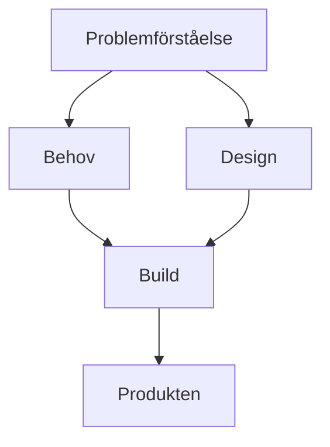
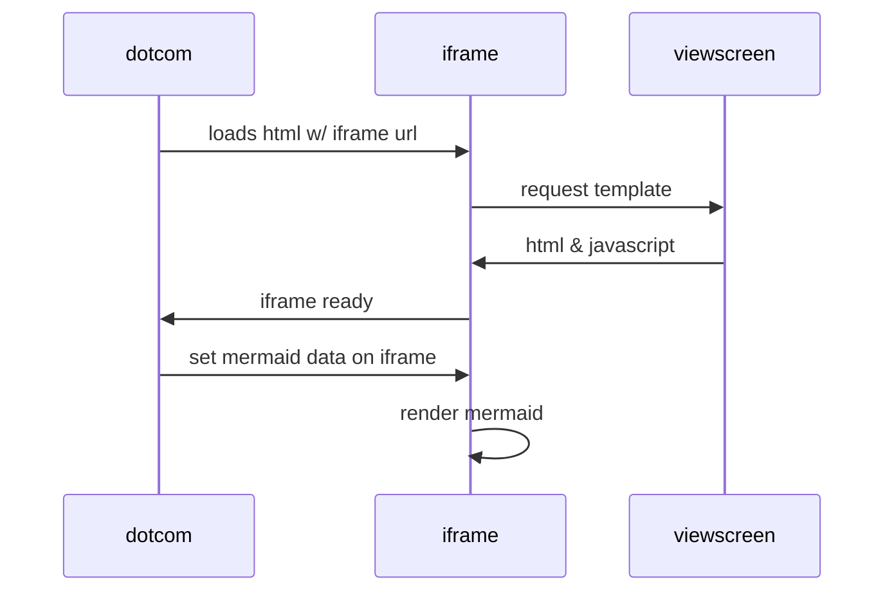

# Initiativ
**_100_ArkDes** Detta är grundläggande mönster om de olika ytor digital produktutveckling behöver, samt den grundläggande rörelsen mellan dessa, 'Indigo Equation' som handlar om en ortogonal och samtidig rörelse mellan dessa. Detta är grunden för att skapa en designsituation.

Under framtagande och kompletteras med 'Designsituatiationen' som bygger på 'Human Dynamics' och 'Engagement Model', båda från IASA/Sveriges IT-arkitekter och är en grund för att bygga kunskap tillsammans inkl hur arbete får genomslag, design och arkitketurarbete blir en lärande loop tillsammans med användare och intressenter.
Samt beskrivning av den tydliga gräns mellan projekt och designsituationen, utgående ifrån 'Design, Process och Metod'.

**_120_ProblemSpace** Detta handlar om grunden i all form av utveckling, att etablera en tydlig bild av vad problemet är man skall lösa, eller rättare sagt, problemen eftersom det nästan utan undantag är flera olika. Förståelse för dessa. Tydlig definition.
Detta är under framtagande i en första version.

**_130_ABCDesEntOrgSociety** Detta är det grundläggande arkitekturmönster vi ser ger design av digitala produkter ett sammanhang hela vägen ner till software engineering.

**_135_Abstract_Base_Classes** Detta är en utvidgning och specialisering av _130

**_150_ReFramings** Detta beskriver den grundläggande rörelsen i designsituationen, från problem via needs och design av produkten, hur man bygger och produkten och praktisk kunskap. En rad grundläggande egenskaper och olika format, som Edgy, EDF, Zachman, olika tjänstedesignverktyg som Service Blueprints.

# Test
Vi testar här Mermaid för att adressera log daterad 251130. From here: https://github.blog/developer-skills/github/include-diagrams-markdown-files-mermaid/

Ett annat exempel...

# Log
251130: 
Första version av readme som beskriver initiativet och en första samling av dessa initiativ.
Reflektion över namnet 'sunsling' som skulle behöva vara något mera abstrakt, förslag 'dpd', 'pdd' el ngn annan abstrakt akronym. 

En insikt är att det är svårt att från de olika katalogerna, Products, Resarch och 'produkterna' _100, _120 osv. förstå hur man kan arbeta. Det behövs någonslags inledning, denna finns inte/är inte tydlig i 'Readme.md' för denna beskriver mer syfte, och koncept kring själva repot, en plats för lärande osv. Faktum är att sättet att arbeta, som börjar med översikten 'The Indigo Equation' och sedan designmönstret för en Produkt, som är ABCDesEnt-pattern beskrivs i _100, men det behöver bli tydligare, Indigo-ekvationen behöver en bättre illustrateion liksom även ABCDesEnt också behöver. 
