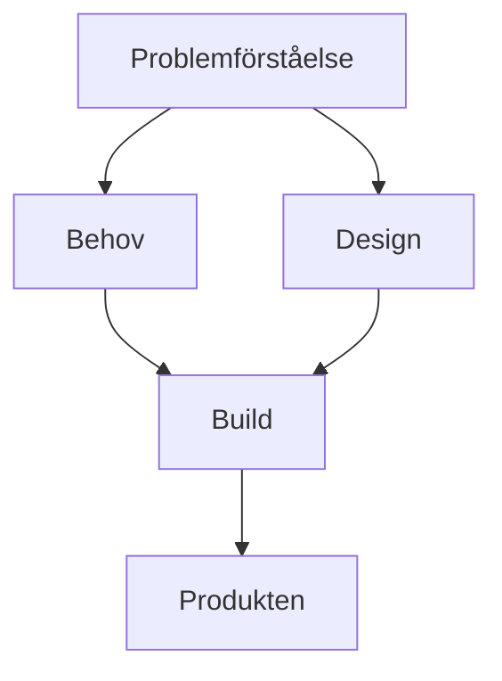
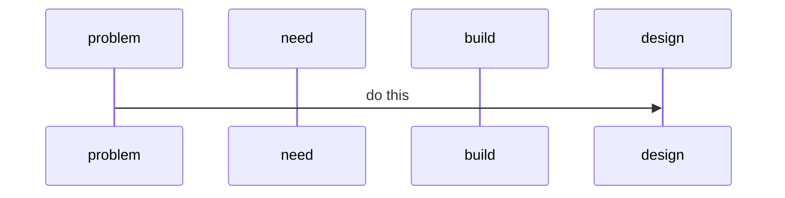

# Initiativ som pågår
Detta är ett pågående arbete och därmed är vad som nu finns här, ett kontinuerligt växande material i omfång och i förståelse och därmed utformning, beskrivning.  

## Story ID_251212-A
**Bakgrund:** Utveckling av digitala produkter handlar alltid om användare, kunder i olika roller men också framför allt om olika personer som skall använda, som leder arbete som utför, i team. I många fall har detta uppmärksammats, särskilt i engelsk litteratur där man använder 'people' isf t.ex 'user'.
**Insikt:** Det är alltid här man måste börja. Metodiker, verktyg olika leverabler är helt och hållet beroende av de olika personer/people. 
**Ansats:** Börja här. Hur skall olika personer kunna använda det som tillhandahålls här, hur skall ett sådant samarbete, en sådan samverkan, coop, collaboration, collective fungera, se ut. Sedan, hur skall det som tillhandahålls här se ut i verksamheten, mot de olika personer inom verksamheten eller de man arbetar med och för. 
Detta är en enda stor HMW som behöver spawnas ut i ett antal stories, vara med som en genomgående egenskap i alla arbeten. Hämta ifrån de metodiker som mer eller mindre adresserar, Edgy/EDF, Team och Org Topologies, Liberating Structures m.m. Det går alltid informera, ofta mildra, ibland lösa.

## Story ID_251211-A
**Bakgrund:** Detta är en av två huvudsakliga stories, iallafall är det ansatsen. Denna rör sättet att arbeta utforskande utifrån arkitekturramverk och designtänkande. 
**Insikt:** Arkitekturramverk, designtänkande, att ta sig genom via en rörelse mellan olika moment, hela tiden utifrån att fånga insikter om vad vi behöver lära oss. 
**Ansats:** Utgå ifrån metodiker som finns, Torres OST, Holistic Product Discovery, Edgy/EDF (senare Archimate). Definiera problemet. Research genom att börja med den kontur Edgy ger. Learn är inte, som i Holistic, en särskild fas utan sker även i explore, structure. (Learning isf Research i Indigo-ekvationen?) 

## Story ID_251211-B
**Bakgrund:** Detta är den andra av en av två huvudsakliga stories. 
**Insikt** Att utföra research och learning, att sedan hålla koll och få en överblick som är andvändbar och arbetsbar när det är soo many details, det kräver ngn typ av verktyg. Visio eller draw.io och formen 'Periodiska systemet' fungerar men det är komplicerat att få ut data som är arbetsbar.
**Insikt:** Visio eller draw.io programmatiskt behandlade, t.ex m Python som script eller i Jupyter verkar fungera. Utifrån möjlighete till 'Data properites' i Shapes som båda dessa verktyg har. Detta kan ta ut, om man använder en enkel mall för data properties, namngivning osv. så går det få ut strukturerad data från modeller som dels kan lista detaljer, insikter, attribut, lösningsförslag osv. Kan formattera i typ .markdown och som sedan kan användas för AI.

# Initiativ att göra
Detta är alltså typ todo el icebox om d är långt ner.

## Story ID_251210-A
**Bakgrund:** Till ArkDes o Human Dynamics eller om d har eget pattern
**Insikt:** Det finns en övertro på att katlägga allt, att ha detaljerade underlag man kan ställa frågor mot osv. 
**Ansats:**Men ibland är det bättre att skapa förutsättningar, organisation, arbetssätt där ma nkan hitta mkt från agila sätt o bättre att bygga en organisation där man snabbt kan få de svar, där alla olika personer o roller är inblandade också är tillgängliga. 

## Story ID_251210-B
**Bakgrund:** Det som avses med detta arbete är att verksamheter skall kunna få igång ett utforskande kring hur de kan etablera sätt att driva utveckling av digitala produkter. Patterns, verktyg här är inte färdiga att användas utan innebär en del i ett arbete som också beskrivs och varje verksamhet behöver få igång.  
**Insikt:** Detta är inte tydligt. Det framgår inte. Det är också oklart hur verksamheter skall kunna få igång detta arbete.  
**Ansats:** Det finns en början i 'Scenarios' men andra sätt kommer att behövas förmodligen och testas för att hitta vad som fungerar. Själva patterns, verktyg och annat material behöver också anpassas så att det kan ingå i detta utforskande.  
  
## Story ID_251210-D
**Bakgrund:** Att fånga problem, förstå dem och kunna beskriva dem, alltså definiera problemen som skall lösas är grundläggande. Ett sätt är via researcharbete som kan förstås via analys, clustring, sensemaking.   
**Insikt:** Det finns en rad verktyg för detta och sätt för detta. Vi har själva ett sådant verktyg som nämns 'Periodiska systemet' men som behöver publiceras - vad vi behöver lära här är egnetligen rätt enkelt, fungerar det för en verksamhet, konceptet att inte publicera färdiga metodiker och verktyg utan istället att en verksamhet kan starta en innovation engine, är det ett koncept som är efterfrågat, vilket vi tror, går det då också att göra.  
**Ansats:** Det finns varianter i både draw.io och i Visio. Visio-varianten har kommit längst och förslag är att anonymisera och publicera så det kan provas - vad vi behöver lära här, behöver definieras ytterligare. En ytterligare ansats är pågående arbete att automatisera via Python för att både kunna producera underlag och normalisera modeller för vidare konsumtion av en AI, detta pågår också och behöver publiceras så det kan provas - vad vi behöver lära här behöver definieras ytterligare.  
  
## Story ID_251210-E 
**Bakgrund:** Det beöhvs maximerat lärande. Det är brett och digert material med många olika patterns, metodiker som refereras till och även verktyg.  
**Insikt:** Detta är alltså i sig något som ger långsam kadens i lärandet.  
**Ansats:** Snabba upp lärande genom att göra det möjligt att prova enkelt. Inspirerat av hur mjukvaruutveckling ofta kan innebära mycket snabba loopar genom att man skriver en liten del av koden, testar, förbättrar. Hur skulle detta kunna göras i detta arbete, som syftar till att få igång en innovation engine.  
  
## Story ID_251210-F
**Bakgrund:** Varje situation i utveckling av digitala produkter är unik.  
**Insikt:** Det finns olika förutsättningar för team, utifrån verksamhetens art, givetvis också vilken typ av produkt och vad problem och behoven är. Sedan är situationen också olika utifrån när i arbetet man är, närmare inledning eller slutfas och vad det är för produkt, nyutveckling eller funktionstillväxt eller underhåll.  
**Ansats:** Givet detta är det alltid vissa moment som behöver göras, som att förstå och fånga vad problemen och behoven är , att föreslå lösningar, men även här är detta olika utifrån situation, reglerade verksamheter, tillgång och typ av kunder man bygger för m.m. Det är också alltid olika intressenter, roller som behöver vara med i arbetet och här är också stor variation utifrån situation.  

## Story ID_251210-G   
**Bakgrund:** Det vi vill med denna site är inte att tillföra fler olika metodiker för detta arbete, vi tillhandahåller dock ett antal, men det är inte huvudsyftet, utan det är istället att vi ser behov utifrån.  
**Insikt:** Återigen, det är vissa moment som alltid behöver göras behov design av lösning o det finns olika patterns som underlättar som ABCDesEnt. Men det vi vill med denna site är att starta en innovation-engine hos respektive verksamhet eller användare där de kan ta best practice våra o andras metodiker o verktyg o får dem att fungera. Tx en kravspec hur skall den se ut för att fungera. Ofta föreslås en mall o en metodik med vissa grunddrag men som alltid måste anpassas för den som skall ta fram o den som skall vara med och förstå och läsa den.  
**Ansats:** Detta vill vi nu starta genom dessa patterns, verktyg som en allra första start. Det måste provas och se vad som fungerar och göras om och prova igen med verksamheter som vill vara med och lära tillsammans. För att se om detta går, om det är en framkomlig väg, om något av alla de olika insikter, ansatser och experiment kan fungera.  
**Vad vi behöver lära oss här:** Men detta vet vi alltså inte om det går. Det är dock en insikt att det behöver göras och de underlag som nu finns är den ansats vi har men detta är i sig ett utforskande arbete, hur skall vi kunna adressera det vi beskriver ovan, den insikt och erfarenhet vi gjort att en orsak till att digitala produktutvecklingsarbeten ofta möter utmaningar är därför att man får givna verktyg, format, modelltyper, metodiker - men behöver anpassa dem, enligt ovan.  
  
## Story ID_251210-H
**Bakgrund:** Många metodiker coh ramverk bygger på dess olika format, vad och hur de tycker man skall göra. T.ex Archimate har ett omfångsrikt språk av olika objekt med olika innebörd och betydelse.  
**Insikt:** Det är två saker här, dels koncept som beskrivs som kanske object, class, users. Grejen är att dessa ofta behövs men kan möta motstånd utifrån vad vi beskriver, i namngivning, form, bara en sådan sak som engelskt språk kan i vissa verksamheter eller mot vissa användare vara en utmaning.  
**Ansats:** Det viktiga är då att i sitt arbete fånga vad koncept, syfte med ett visst objekt, en modell och att istället utgå ifrån vad som behövs i just vår egen verksamhet, vad fungerar i en viss situation och det kanske är något helt annat, text, flanellograf för att hårddra. Det vi förlorar är kompabilitet och förståelse men hur viktigt är detta, om vi i organisationen, teamet är medvetna om och förstår och kan översätta där det behövs t.ex mot externa aktörer.  
**Insikt:** En annan insikt är att i många fall är den detaljrikedom som behövs bara för vissa roller, som t.ex arkitekter.  
**Ansats:** Är man entydig med vad saker och ting betyder är detta sällan ett problem och man får väga pregnans mot förståelse och att hela verksamheten förstår.  
**Insikt:** En annan sak vi ser är att mjukvaruutveckling ger möjlighet till mycket snabba feedback-loopar vilket gör att lärande accelereras.  
**Ansats:** I en programutvecklingsmiljö kan man enkelt testa olika koncept genom att skriva kod och prova den, mer eller mindre omgående. Detta ger möjlighet framför allt att testa olika varianter av koncept. Att få fram mjukvara som uppfyller behov eller löser mera komplexa funktioner tar givetvis tid. Detta är något vi vill försöka replikera i de sätt och verktyg och patterns vi föreslår. Det skall gå snabbt att prova olika varianter exempelvis kring hur en leverabel tas emot av olika målgrupper, roller, användare.  

# Done

**_100_ArkDes** Detta är grundläggande mönster om de olika ytor digital produktutveckling behöver, samt den grundläggande rörelsen mellan dessa, 'Indigo Equation' som handlar om en ortogonal och samtidig rörelse mellan dessa. Detta är grunden för att skapa en designsituation.

Under framtagande och kompletteras med 'Designsituatiationen' som bygger på 'Human Dynamics' och 'Engagement Model', båda från IASA/Sveriges IT-arkitekter och är en grund för att bygga kunskap tillsammans inkl hur arbete får genomslag, design och arkitketurarbete blir en lärande loop tillsammans med användare och intressenter.
Samt beskrivning av den tydliga gräns mellan projekt och designsituationen, utgående ifrån 'Design, Process och Metod'.

**_120_ProblemSpace** Detta handlar om grunden i all form av utveckling, att etablera en tydlig bild av vad problemet är man skall lösa, eller rättare sagt, problemen eftersom det nästan utan undantag är flera olika. Förståelse för dessa. Tydlig definition.
Detta är under framtagande i en första version.

**_130_ABCDesEntOrgSociety** Detta är det grundläggande arkitekturmönster vi ser ger design av digitala produkter ett sammanhang hela vägen ner till software engineering.

**_135_Abstract_Base_Classes** Detta är en utvidgning och specialisering av _130

**_150_ReFramings** Detta beskriver den grundläggande rörelsen i designsituationen, från problem via needs och design av produkten, hur man bygger och produkten och praktisk kunskap. En rad grundläggande egenskaper och olika format, som Edgy, EDF, Zachman, olika tjänstedesignverktyg som Service Blueprints.

# Test
Vi testar här Mermaid för att adressera log daterad 251130. From here: https://github.blog/developer-skills/github/include-diagrams-markdown-files-mermaid/

Ett annat exempel...

# Log
__251208:__
Vi börjar med utifrån denna premiss se på de typiska situationer som uppstår vid digital produktutveckling och hur man skulle kunna adressera dem. 
Ett typiskt fall är: Hur börjar vi arbeta i ett projekt som skall ta fram en ny digital produkt. Bygga. Köpa/upphandling. Förbättra såpass mycket att det kan anses vara mer än bara löpande funktionstillväxt. 
 
Ett designorienterat arbetssätt behövs för komplexa problem men traditionell projektledning och i viss mån även viss agil, har svårt att hantera detta. Därför behövs en ’designsituation’ vilket vi pratar om i ’DesignSituationPlastboxen’. I denna ingår att få utrymme att arbeta med de verktyg o metodiker som passar situationen. Med ’engagement model’ och ’human dynamics’ finns sätt att hantera faktum att man måste i ett designarbete anpassa sig till både verksamhetens organisation och art/kultur. 

Det uppstår i även mindre projekt snabbt stora mängder information som skall hanteras, från research, vid olika sätt att förstå och prova ideer och förslag och när man bygger produkten. - ’Periodiska systemet’ är ett sätt att få research hanterbar.
- Indigoekvationen är ett sätt att brett ta sig an, både i analys men också samtidigt börja bygga på produkten på ett utforskande sätt. 
- Torres/OST är en naturlig metodik att hantera detta utforskande. Men här behövs insatser för att få detta att fungera och detta tror vi är värt att adressera.
- Att utgå från ett mönster i form av ABCDesEnt, att ha som mall ffa för att ta sig hela vägen från research via anlys av behov och design och till att bygga produkten, i kombination med ’reframings’ utifrån arkitekturmodellspåk antingen Edgy eller Archimate

__251130:__ 
Första version av readme som beskriver initiativet och en första samling av dessa initiativ.
Reflektion över namnet 'sunsling' som skulle behöva vara något mera abstrakt, förslag 'dpd', 'pdd' el ngn annan abstrakt akronym. 

En insikt är att det är svårt att från de olika katalogerna, Products, Resarch och 'produkterna' _100, _120 osv. förstå hur man kan arbeta. Det behövs någonslags inledning, denna finns inte/är inte tydlig i 'Readme.md' för denna beskriver mer syfte, och koncept kring själva repot, en plats för lärande osv. Faktum är att sättet att arbeta, som börjar med översikten 'The Indigo Equation' och sedan designmönstret för en Produkt, som är ABCDesEnt-pattern beskrivs i _100, men det behöver bli tydligare, Indigo-ekvationen behöver en bättre illustrateion liksom även ABCDesEnt också behöver. 
