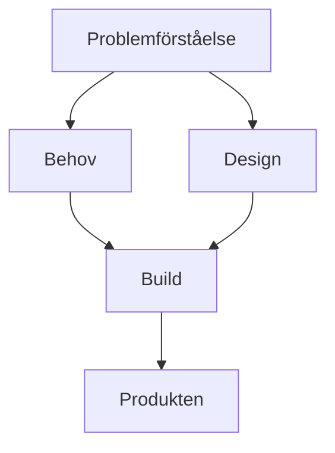
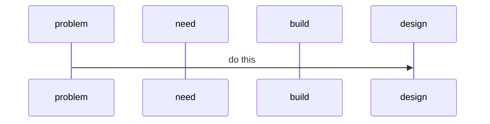

# Initiativ
**_100_ArkDes** Detta är grundläggande mönster om de olika ytor digital produktutveckling behöver, samt den grundläggande rörelsen mellan dessa, 'Indigo Equation' som handlar om en ortogonal och samtidig rörelse mellan dessa. Detta är grunden för att skapa en designsituation.

Under framtagande och kompletteras med 'Designsituatiationen' som bygger på 'Human Dynamics' och 'Engagement Model', båda från IASA/Sveriges IT-arkitekter och är en grund för att bygga kunskap tillsammans inkl hur arbete får genomslag, design och arkitketurarbete blir en lärande loop tillsammans med användare och intressenter.
Samt beskrivning av den tydliga gräns mellan projekt och designsituationen, utgående ifrån 'Design, Process och Metod'.

**_120_ProblemSpace** Detta handlar om grunden i all form av utveckling, att etablera en tydlig bild av vad problemet är man skall lösa, eller rättare sagt, problemen eftersom det nästan utan undantag är flera olika. Förståelse för dessa. Tydlig definition.
Detta är under framtagande i en första version.

**_130_ABCDesEntOrgSociety** Detta är det grundläggande arkitekturmönster vi ser ger design av digitala produkter ett sammanhang hela vägen ner till software engineering.

**_135_Abstract_Base_Classes** Detta är en utvidgning och specialisering av _130

**_150_ReFramings** Detta beskriver den grundläggande rörelsen i designsituationen, från problem via needs och design av produkten, hur man bygger och produkten och praktisk kunskap. En rad grundläggande egenskaper och olika format, som Edgy, EDF, Zachman, olika tjänstedesignverktyg som Service Blueprints.

# Test
Vi testar här Mermaid för att adressera log daterad 251130. From here: https://github.blog/developer-skills/github/include-diagrams-markdown-files-mermaid/

Ett annat exempel...

# Log
__251208:__
Vi börjar med utifrån denna premiss se på de typiska situationer som uppstår vid digital produktutveckling och hur man skulle kunna adressera dem. 
Ett typiskt fall är: Hur börjar vi arbeta i ett projekt som skall ta fram en ny digital produkt. Bygga. Köpa/upphandling. Förbättra såpass mycket att det kan anses vara mer än bara löpande funktionstillväxt. 
 
Ett designorienterat arbetssätt behövs för komplexa problem men traditionell projektledning och i viss mån även viss agil, har svårt att hantera detta. Därför behövs en ’designsituation’ vilket vi pratar om i ’DesignSituationPlastboxen’. I denna ingår att få utrymme att arbeta med de verktyg o metodiker som passar situationen. Med ’engagement model’ och ’human dynamics’ finns sätt att hantera faktum att man måste i ett designarbete anpassa sig till både verksamhetens organisation och art/kultur. 

Det uppstår i även mindre projekt snabbt stora mängder information som skall hanteras, från research, vid olika sätt att förstå och prova ideer och förslag och när man bygger produkten. - ’Periodiska systemet’ är ett sätt att få research hanterbar.
- Indigoekvationen är ett sätt att brett ta sig an, både i analys men också samtidigt börja bygga på produkten på ett utforskande sätt. 
- Torres/OST är en naturlig metodik att hantera detta utforskande. Men här behövs insatser för att få detta att fungera och detta tror vi är värt att adressera.
- Att utgå från ett mönster i form av ABCDesEnt, att ha som mall ffa för att ta sig hela vägen från research via anlys av behov och design och till att bygga produkten, i kombination med ’reframings’ utifrån arkitekturmodellspåk antingen Edgy eller Archimate

__251130:__ 
Första version av readme som beskriver initiativet och en första samling av dessa initiativ.
Reflektion över namnet 'sunsling' som skulle behöva vara något mera abstrakt, förslag 'dpd', 'pdd' el ngn annan abstrakt akronym. 

En insikt är att det är svårt att från de olika katalogerna, Products, Resarch och 'produkterna' _100, _120 osv. förstå hur man kan arbeta. Det behövs någonslags inledning, denna finns inte/är inte tydlig i 'Readme.md' för denna beskriver mer syfte, och koncept kring själva repot, en plats för lärande osv. Faktum är att sättet att arbeta, som börjar med översikten 'The Indigo Equation' och sedan designmönstret för en Produkt, som är ABCDesEnt-pattern beskrivs i _100, men det behöver bli tydligare, Indigo-ekvationen behöver en bättre illustrateion liksom även ABCDesEnt också behöver. 
